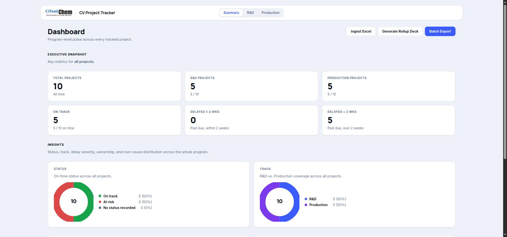
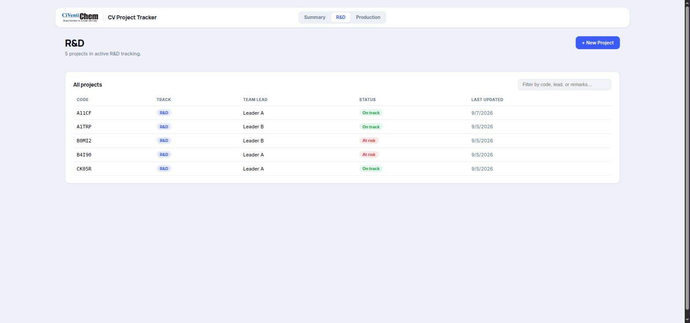
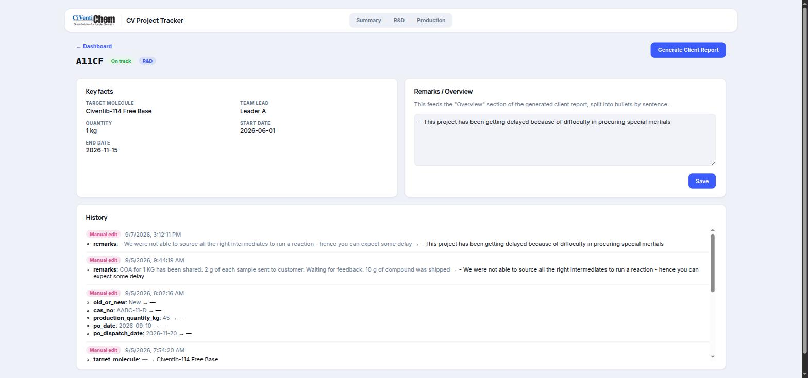

# CiVentiChem AI Roadmap

**Confidential proposal**
Prepared for: CiVentiChem
Prepared by: Rohan Vyas
Status: Draft, for internal review
Engagement type: Phased, gated delivery
Deployment model: 100% on-premise
Estimated duration: 9-14 weeks, phase-gated

Live site (Vercel, themed to match the tracker app): https://civentichem-ai-roadmap.vercel.app
Live formatted version (Claude artifact): https://claude.ai/code/artifact/82afdc50-1398-465e-bf9c-00ab37f32735

A fully on-prem path from process tracker to institutional memory: four gated phases (NDA, local deployment, archive digitization, then a local AI layer that can answer "how did we solve this before") with nothing ever leaving CiVentiChem's own machines.

## Standing constraint, all four phases

Everything (the application, the archive, and the AI models) runs on hardware CiVentiChem owns and controls. No cloud database, no third-party LLM API, no telemetry, no data egress at any point. This is the one requirement every phase below is designed around, not a checkbox added at the end.

## Roadmap at a glance

| Phase | Name | Duration |
|---|---|---|
| 00 | Confidentiality & Engagement Setup | 3-5 days |
| 01 | Infra Readiness & Local Deployment | 1-2 weeks |
| 02 | Archive Audit, Prep & Capacity Planning | 3-5 weeks |
| 03 | Local AI Knowledge Layer | 4-6 weeks |

## Already built: what Phase 1 puts on their machine

The tracker referenced throughout this roadmap is a working application today, not a concept.

*Executive dashboard. Live status, delay severity, and R&D/Production split, computed from dates, not a stale imported flag.*

*R&D project list. Filterable by code, lead, or remarks; the same view pattern is reused for Production.*

*Project detail & audit trail. Every field change, manual or Excel-imported, is timestamped and diffed automatically.*

---

## Phase 0 - Confidentiality & Engagement Setup

*3-5 days, legal turnaround*

Nothing gets installed, copied, or even looked at until the paperwork makes the local-only promise contractual, not just verbal.

**Workstreams**

- **Mutual NDA** - covers process data, formulations, client/customer lists, and any archival material reviewed. Countersigned by both parties before any device or file is touched.
- **Data-handling addendum** - written statement that no data leaves CiVentiChem's network or premises. No cloud APIs, no third-party logging or telemetry, in writing, not assumed.
- **Scope & access** - one-page scope note both sides sign defining what "done" means per phase. Named point of contact, site-visit scheduling, IT escort/access policy for on-site work.

**Deliverables**

- Signed NDA
- Data-handling addendum (zero-egress clause)
- One-page scope & success-criteria note

**Gate to Phase 1:** NDA countersigned and the scope note approved by name on both sides.

---

## Phase 1 - Infrastructure Readiness & Local Deployment

*1-2 weeks, on-site + remote*

Before installing anything, understand what CiVentiChem actually has to run it on, then put the tracker on it, and make sure their own people can drive it without you in the room.

**Workstreams**

**A. Hardware & IT environment audit**
- Inventory candidate machine(s): CPU, RAM, free disk, OS version, uptime pattern
- Network topology: LAN-only vs. any internet egress, firewall/proxy rules, domain policy
- IT constraints: admin rights, AV exclusions needed, patch/reboot cycle, existing backup or imaging schedule
- Decide the target: a single power-user PC vs. a small dedicated on-prem box, based on concurrent-user count

**B. Local application deployment**
- Install runtime dependencies once, offline-capable thereafter
- Deploy the tracker (backend + frontend) as a local service that auto-starts on boot
- Put the database on a volume that's already inside the client's backup routine
- Configure a scheduled local backup (NAS or external drive); no cloud backup targets

**C. Basic training**
- Two short sessions for project leads and production staff: daily usage, Excel ingest, reading the dashboard, generating client reports
- One-page quick-reference guide left behind in print and on the shared drive

**Watch: Phase 1 implementation walkthrough** (Loom recording, local deployment and first-run training, end to end)
https://www.loom.com/share/38b9f9ec80e9459db69d7ce160e6f28f

**Deliverables**

- Infrastructure audit note (hardware, network, IT constraints, recommended deployment target)
- Tracker deployed and running on CiVentiChem hardware, with backups configured
- Training sessions delivered + one-page quick-reference guide

**Gate to Phase 2:** App runs independently on client hardware, with no dependency on your laptop, and at least two staff can operate it unassisted. A test restore from backup succeeds.

---

## Phase 2 - Archive Audit, Data Preparation & Capacity Planning

*3-5 weeks, depends on archive volume*

Find out what CiVentiChem's history actually consists of, get it into a shape a machine can use, and size, in concrete numbers, the storage and compute that Phase 3 will need.

**Workstreams**

**A. Data discovery & cataloging**
- Inventory legacy Excel trackers, PDF SOPs/COAs/batch records, scanned notebooks, email threads, shared-drive folders
- Classify by type, project/molecule, sensitivity, current volume, and owner

**B. Data preparation**
- Clean, de-duplicate, normalize project codes and molecule names
- OCR for scanned/handwritten records where needed
- Structure into a tagged schema (project, process step, date, outcome)
- Pilot batch reviewed with client SMEs before the full pass

**C. Storage & AI hardware sizing**
- Size raw archive + structured copy + vector-index overhead + backup margin
- Match compute tier to data volume, concurrent users, and latency expectations
- Output is a methodology and a range now; a final number follows once the full catalog from A is in

**Sizing methodology, worked example**

| Layer | Estimate basis | Notes |
|---|---|---|
| Raw archive | Measured directly in 2A | Typical CRO paper/scan archive of this size runs low tens of GB once scanned notebooks and COAs are included; confirmed, not assumed, during cataloging. |
| Structured / cleaned copy | ~1.0-1.3x raw | Normalized text, OCR output, and metadata tags alongside the originals (originals are never deleted). |
| Vector index (Phase 3) | ~0.2-0.4x raw text volume | Embeddings for search, small relative to the documents themselves. |
| Backup / versioning margin | 2x the above, minimum | One local, one offline/cold copy, still zero cloud, per the standing constraint. |
| Recommended tier | 2-4 TB NAS, RAID-1 or better | Comfortable 3-5 year growth buffer at this archive's likely scale; revisit after the Phase 2A catalog confirms actual volume. |
| AI compute: light tier | 32-64 GB RAM, CPU-only | Sufficient for a handful of users, a quantized 7-8B model, and <50k archived documents. |
| AI compute: standard tier | 1x 16-24 GB VRAM GPU | Needed once several people query concurrently, or a larger (13B-class) model is wanted for richer synthesis. |

**Deliverables**

- Data inventory sheet (source, format, volume, sensitivity, owner)
- Cleaned, structured pilot dataset, SME-reviewed
- Storage sizing report with a concrete TB recommendation
- AI hardware recommendation memo (tier + specific components)

**Gate to Phase 3:** SMEs sign off on the structured pilot dataset's accuracy, and CiVentiChem has decided on (and, ideally, procured) the storage/compute tier.

---

## Phase 3 - Local AI Knowledge & Insight Layer

*4-6 weeks, build + iterate*

Turn the structured archive into something the team can ask questions of, in plain language, entirely offline, with every answer traceable back to a real document.

**Workstreams**

**A. Architecture & build**
- Local embedding model + on-disk vector store, no external calls at any point
- Local LLM runtime sized to the Phase 2 hardware decision (e.g. Ollama / llama.cpp class tooling)
- Shipped as a module inside the existing tracker UI, not a separate tool to log into

**B. Capabilities**
- Natural-language search across historical projects and processes
- "How was this handled before" retrieval, with citations to the source document
- Cross-project pattern surfacing: recurring delay causes, learnings by molecule family
- Auto-summarized learnings digest per project or process family

**C. Validation & guardrails**
- Accuracy testing against a blind set of real historical questions, reviewed by SMEs
- Citation-only answers; an explicit "not found in the archive" fallback instead of a guess
- Admin/maintenance guide so CiVentiChem's own IT can run it without you

**Deliverables**

- Working local AI assistant module inside the tracker
- Evaluation report against the SME-reviewed test set
- Admin & maintenance guide

**Definition of done:** SMEs confirm the assistant's answers are accurate and correctly cited on the blind test set, running fully offline on CiVentiChem's own hardware.

---

## Beyond this proposal

**Local-only technology stack.** Every component chosen for this roadmap has an on-prem-capable option with no mandatory cloud dependency: local LLM runtime, on-disk vector store, local embeddings, SQLite / local DB, scheduled local backup, zero telemetry.

**Deliberately out of scope, for now**
- Commercial terms & pricing: a separate document once Phase 2 sizing is confirmed
- Ongoing support/maintenance retainer after Phase 3: proposed separately once the assistant is live
- Any cloud, hybrid, or multi-site deployment: explicitly excluded by CiVentiChem's local-only requirement

---

Draft roadmap, prepared for internal review before sharing with CiVentiChem. Durations are estimates to be refined once the Phase 1 site visit and Phase 2 data catalog are complete.
